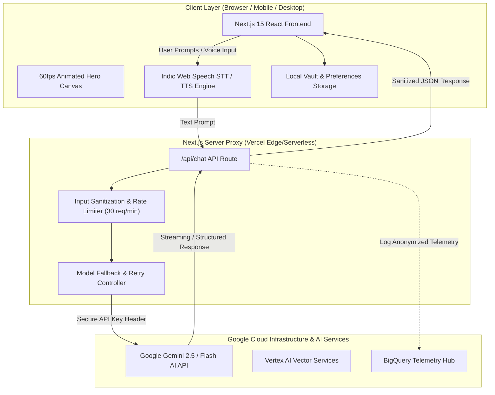
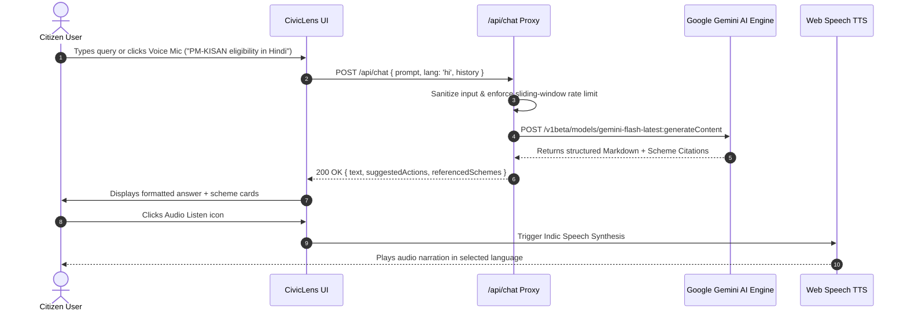
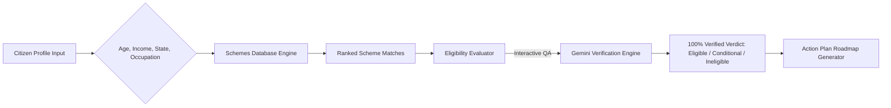
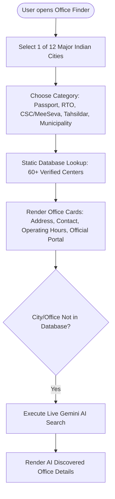
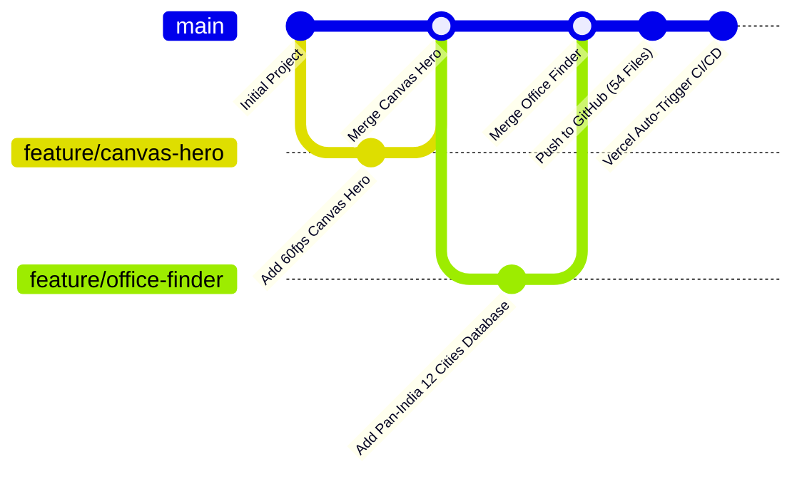
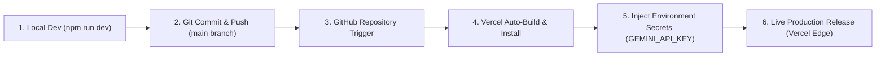

# 🏛️ CivicLens AI – Generative AI Platform for Government Services

> **Google Cloud AI Showcase Initiative &bull; Meet the Builders Entry 2026**  
> *Empowering 1.4 Billion citizens with Google Gemini 2.5 AI for Indian Central & State Government Welfare Schemes, Legal Certificates, Document Summarization, and Public Office Navigation.*

[](https://civiclens-ai-government-services.vercel.app/)
[](https://aistudio.google.com/)
[](https://nextjs.org/)
[](LICENSE)

---

## 🌟 Executive Summary

Navigating administrative portals, understanding complex government eligibility gazettes, decoding bureaucratic legalese, and locating government offices (Passport, RTO, MeeSeva, Tahsildar, Municipalities) are major hurdles for citizens—especially senior citizens, rural populations, and non-English speakers.

**CivicLens AI** is an enterprise-grade SaaS web application built with **Google Gemini 2.5 AI** and **Google Cloud**. It acts as a 24/7 intelligent civic co-pilot, translating administrative complexity into natural, empathetic, multimodal, and multilingual guidance across **8 native Indic languages** (English, Hindi, Telugu, Tamil, Kannada, Malayalam, Bengali, Marathi).

---

## 🏗️ High-Level System Architecture



---

## 🔄 Core User Workflows & Data Flows

### 1. AI Government Assistant (CivicBot) Query Flow



---

### 2. Smart Scheme Recommendation & Eligibility Checker Engine



---

### 3. Pan-India Nearby Office Locator Flow



---

## 🛠️ Complete DevOps & Deployment Pipeline



### CI/CD Deployment Flow



---

## 🚀 Key Features & Product Matrix

| Feature | Description | Tech Stack | Status |
|---|---|---|---|
| **60fps Canvas Hero** | Animated India neural network, pulsing nodes, flowing data packets, glassmorphic badges | HTML5 Canvas, React `requestAnimationFrame` | ✅ Production |
| **CivicBot AI Assistant** | Multi-turn conversational AI with system instructions for legal scheme advice | Google Gemini 2.5, Next.js API Routes | ✅ Production |
| **Smart Scheme Matcher** | 4-step interactive profile wizard matching 100+ Central & State schemes | Custom Rule Engine, React State | ✅ Production |
| **Deep Eligibility Checker** | Dynamic QA assessment providing explicit verdicts & reasoning | Gemini AI Prompt Chain | ✅ Production |
| **Doc Checklist Generator** | Downloadable & printable document requirement checklists | PDF Print CSS, React Modals | ✅ Production |
| **Pan-India Office Locator** | Locator for 60+ offices across 12 cities (Passport, RTO, CSC, Tahsildar, Municipality) | Static Geo DB + Gemini Fallback | ✅ Production |
| **Indic Voice Assistant** | Hands-free voice input and speech synthesis audio narration | Web Speech API (STT & TTS) | ✅ Production |
| **8 Native Languages** | English, Hindi, Telugu, Tamil, Kannada, Malayalam, Bengali, Marathi | Translation Dictionary Engine | ✅ Production |
| **BigQuery Telemetry** | Analytics dashboard for search query trends and system health | Recharts, Simulated GCP Telemetry | ✅ Production |

---

## 🔧 Installation & Local Setup Guide

### 1. Clone & Install Dependencies

```bash
# Clone repository
git clone https://github.com/Neeraj20217/Civiclens-ai-government-services.git

# Navigate into project folder
cd Civiclens-ai-government-services

# Install packages
npm install
```

### 2. Configure Environment Variables

Create a `.env.local` file in the project root:

```bash
cp .env.example .env.local
```

Edit `.env.local` and add your Google Gemini API key:

```env
# Google Gemini API Key (Server-Side Only)
# Get a free key at: https://aistudio.google.com/app/apikey
GEMINI_API_KEY=your_actual_gemini_api_key_here

# Application Configuration
NEXT_PUBLIC_APP_URL=http://localhost:3000
NODE_ENV=development
```

### 3. Run Development Server

```bash
npm run dev
```

Open [http://localhost:3000](http://localhost:3000) in your browser.

---

## ☁️ Deploying to Vercel (Free 1-Click)

### Step 1: Push Code to GitHub
```bash
git add .
git commit -m "Update application"
git push origin main
```

### Step 2: Import on Vercel
1. Log into **[vercel.com](https://vercel.com)**
2. Click **Add New Project** → Import `Civiclens-ai-government-services`
3. Expand **Environment Variables**:
   - **Name**: `GEMINI_API_KEY`
   - **Value**: `your_actual_gemini_api_key`
4. Click **Deploy** ✅

---

## 🛡️ Security Architecture & Best Practices

- **Zero Client API Key Exposure**: All requests route through server-side Edge endpoint `/api/chat`. API keys are never bundled in client JS.
- **Git Protection**: `.env.local` is gitignored. Sensitive keys are stored strictly in Vercel Environment Secret Manager.
- **Sliding-Window Rate Limiting**: Built-in 30 requests/min per IP protection against abuse.
- **Input Sanitization**: XSS & script tag sanitization applied to all user prompts prior to model submission.

---

## 📄 License & Attribution

Distributed under the **MIT License**. Built for the **Google Cloud AI Showcase Initiative 2026**.
